## KITTI GIF출력 결과(모든 오브젝트 포함)

<table>
  <tr>
    <td align="center">
       
      
kitti_0000_topview.gif

    </td>
    <td align="center">
      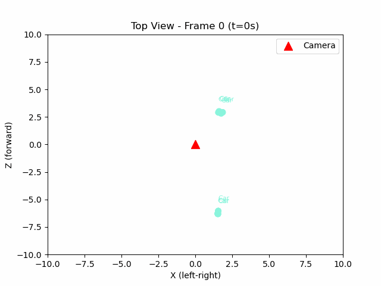 
      
kitti_0001_topview.gif

    </td>
    <td align="center">
      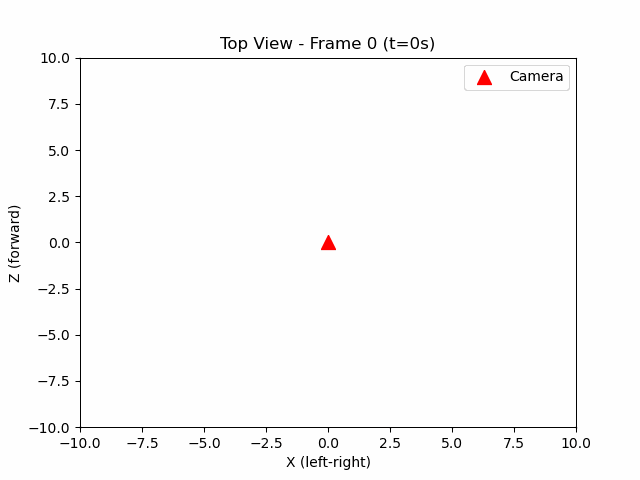 
      
kitti_0002_topview.gif

    </td>
  </tr>
  <tr>
    <td align="center">
      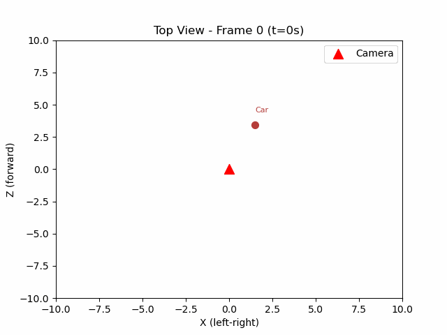 
      
kitti_0003_topview.gif

    </td>
    <td align="center">
      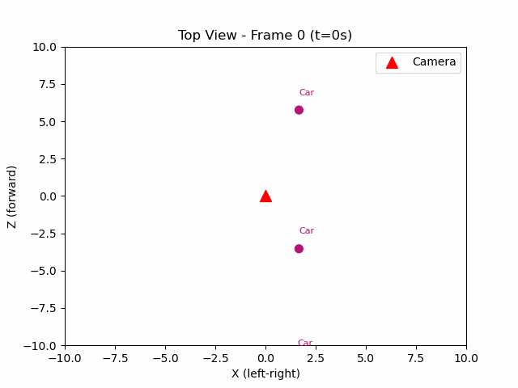 
      
kitti_0004_topview.gif

    </td>
    <td align="center">
      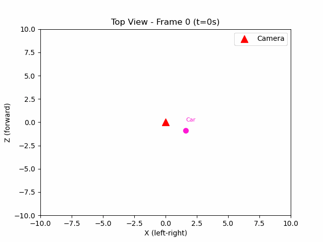 
      
kitti_0005_topview.gif

    </td>
  </tr>
  <tr>
    <td align="center">
      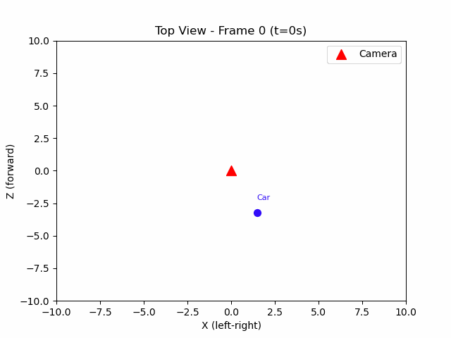 
      
kitti_0006_topview.gif

    </td>
    <td align="center">
      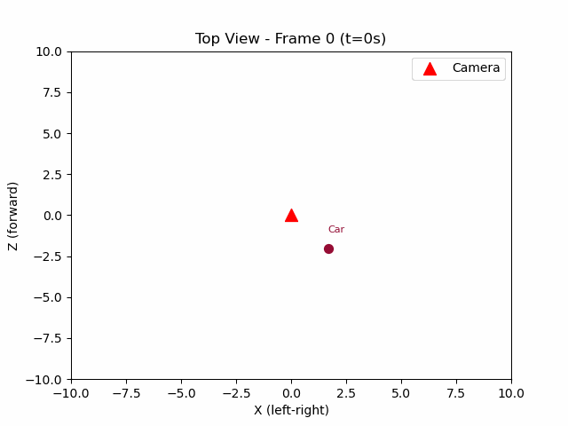 
      
kitti_0007_topview.gif

    </td>
    <td align="center">
      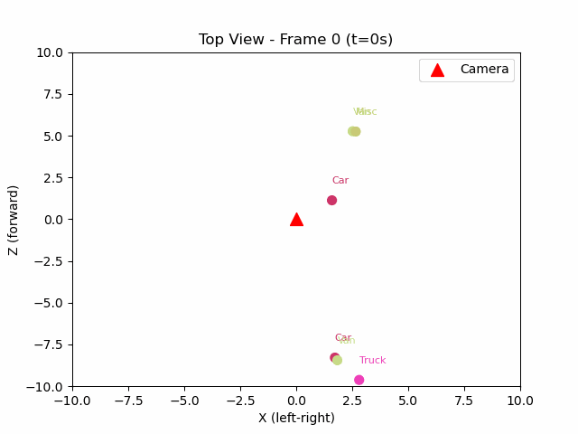 
      
kitti_0008_topview.gif

    </td>
  </tr>
  <tr>
    <td align="center">
      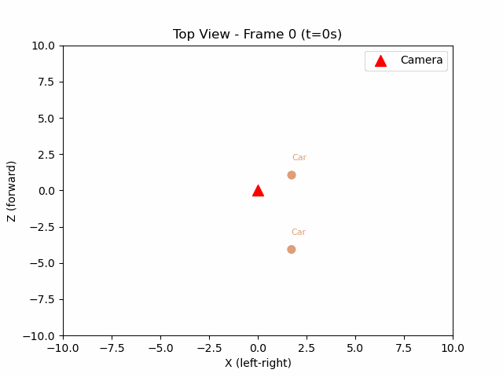 
      
kitti_0009_topview.gif

    </td>
    <td align="center">
      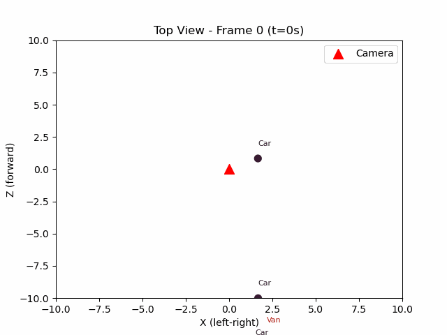 
      
kitti_0010_topview.gif

    </td>
    <td align="center">
      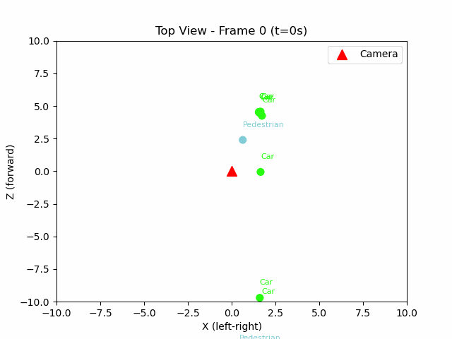 
      
kitti_0011_topview.gif

    </td>
  </tr>
  <tr>
    <td align="center">
      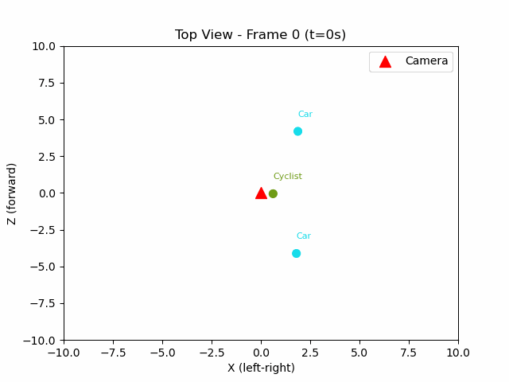 
      
kitti_0012_topview.gif

    </td>
    <td align="center">
      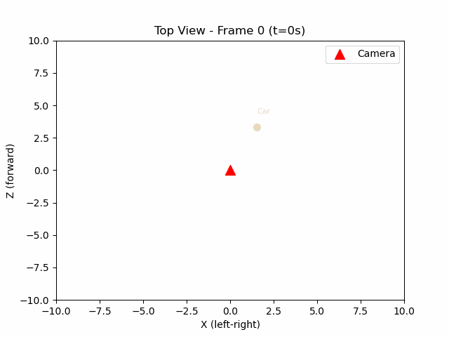 
      
kitti_0013_topview.gif

    </td>
    <td align="center">
      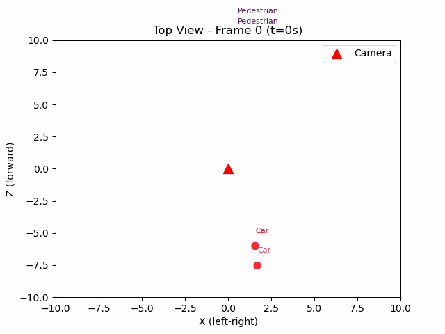 
      
kitti_0014_topview.gif

    </td>
  </tr>
  <tr>
    <td align="center">
      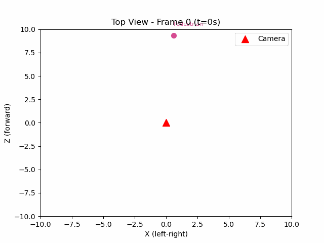 
      
kitti_0015_topview.gif

    </td>
    <td align="center">
      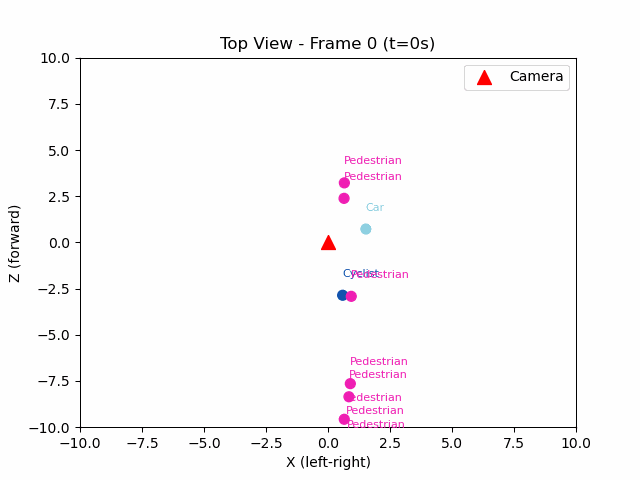 
      
kitti_0016_topview.gif

    </td>
    <td align="center">
      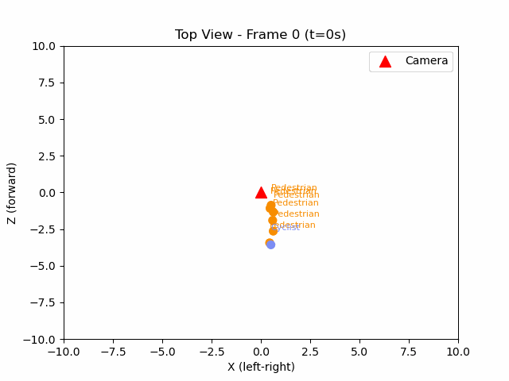 
      
kitti_0017_topview.gif

    </td>
  </tr>
  <tr>
    <td align="center">
      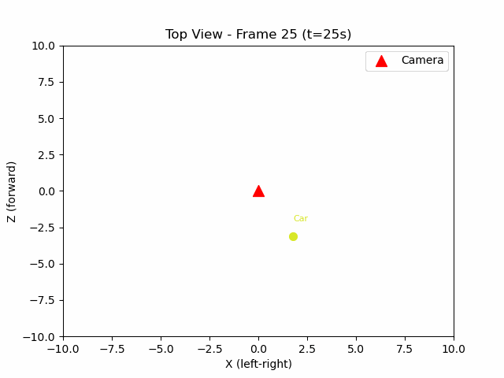 
      
kitti_0018_topview.gif

    </td>
    <td align="center">
       
      
kitti_0019_topview.gif

    </td>
    <td align="center">
      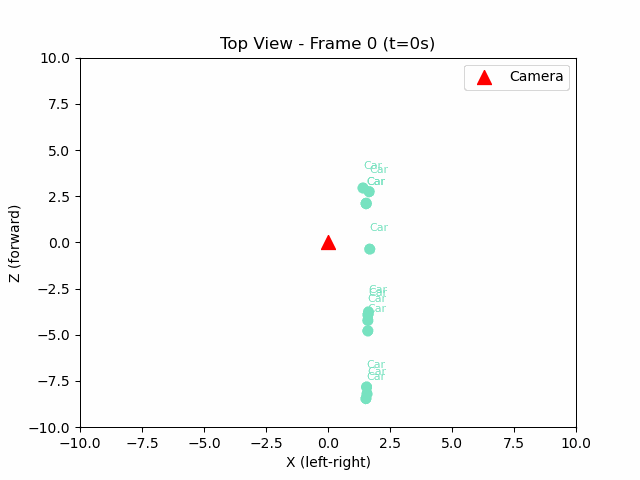 
      
kitti_0020_topview.gif

    </td>
  </tr>
</table>

## KITTI GIF출력 결과(보행자만)

<table>
  <tr>
    <td align="center">
      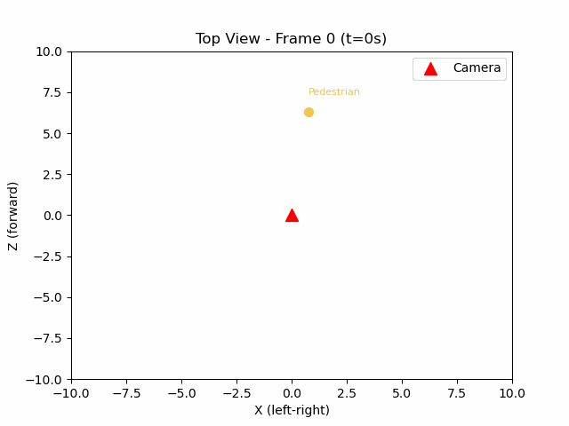 
      
kitti_0000_topview.gif

    </td>
    <td align="center">
       
      
kitti_0001_topview.gif

    </td>
    <td align="center">
       
      
kitti_0002_topview.gif

    </td>
  </tr>
  <tr>
    <td align="center">
       
      
kitti_0003_topview.gif

    </td>
    <td align="center">
       
      
kitti_0004_topview.gif

    </td>
    <td align="center">
       
      
kitti_0005_topview.gif

    </td>
  </tr>
  <tr>
    <td align="center">
       
      
kitti_0006_topview.gif

    </td>
    <td align="center">
       
      
kitti_0007_topview.gif

    </td>
    <td align="center">
       
      
kitti_0008_topview.gif

    </td>
  </tr>
  <tr>
    <td align="center">
       
      
kitti_0009_topview.gif

    </td>
    <td align="center">
       
      
kitti_0010_topview.gif

    </td>
    <td align="center">
      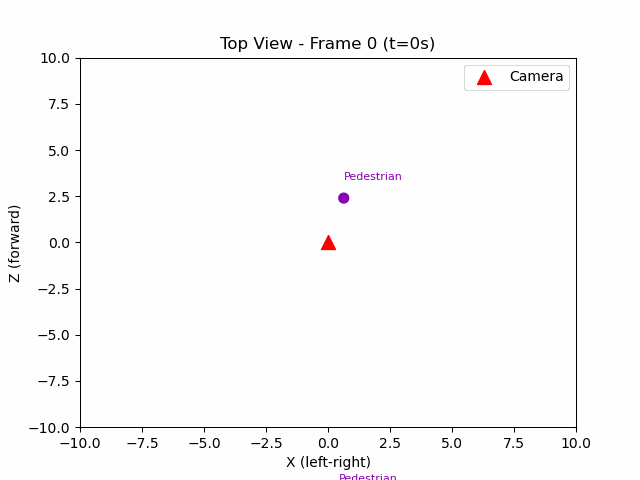 
      
kitti_0011_topview.gif

    </td>
  </tr>
  <tr>
    <td align="center">
       
      
kitti_0012_topview.gif

    </td>
    <td align="center">
       
      
kitti_0013_topview.gif

    </td>
    <td align="center">
      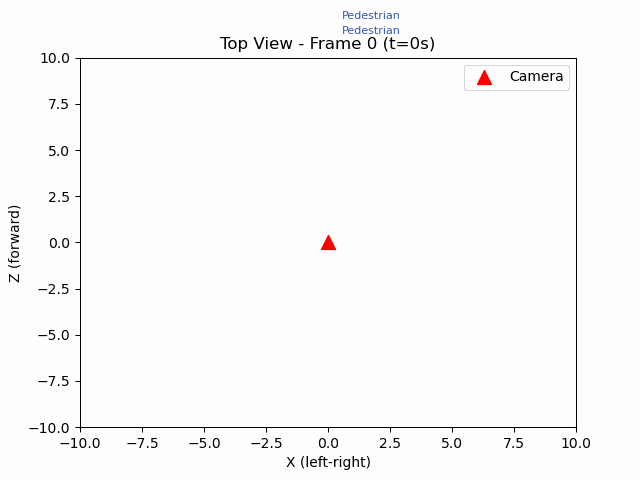 
      
kitti_0014_topview.gif

    </td>
  </tr>
  <tr>
    <td align="center">
      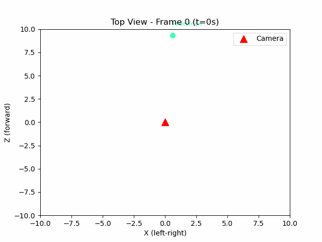 
      
kitti_0015_topview.gif

    </td>
    <td align="center">
      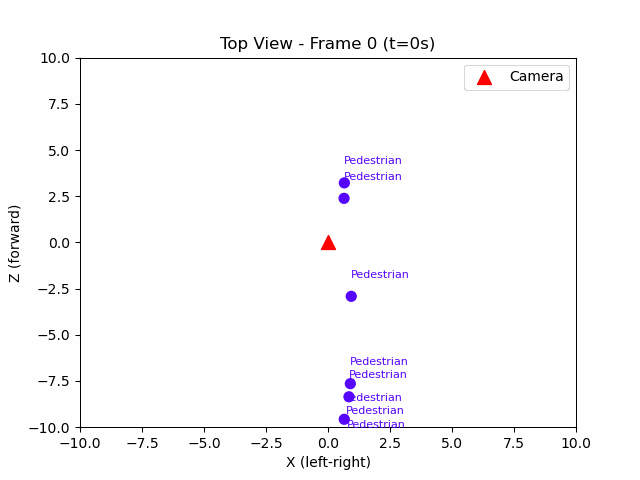 
      
kitti_0016_topview.gif

    </td>
    <td align="center">
      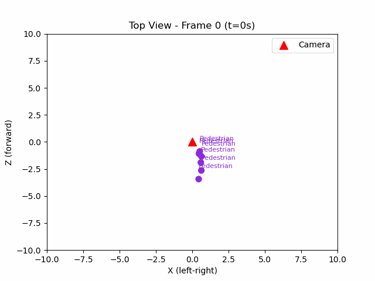 
      
kitti_0017_topview.gif

    </td>
  </tr>
  <tr>
    <td align="center">
       
      
kitti_0018_topview.gif

    </td>
    <td align="center">
       
      
kitti_0019_topview.gif

    </td>
    <td align="center">
       
      
kitti_0020_topview.gif

    </td>
  </tr>
</table>
## 라이다 데이터 

  
lidar_animation.gif 

   

## 라이다 데이터와 카메라 켈리브레이션 통해 이미지에서 라이다 정보 가져오기

