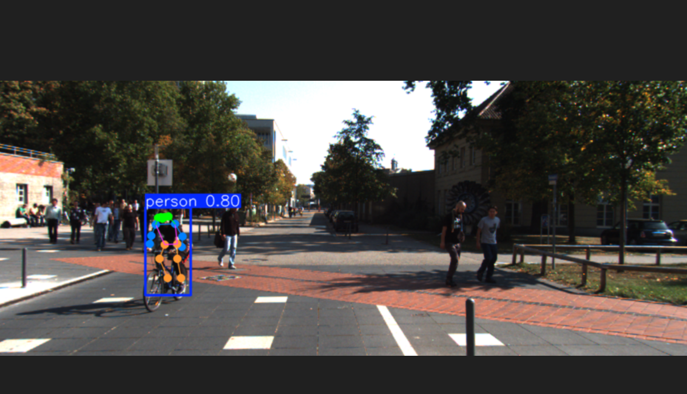
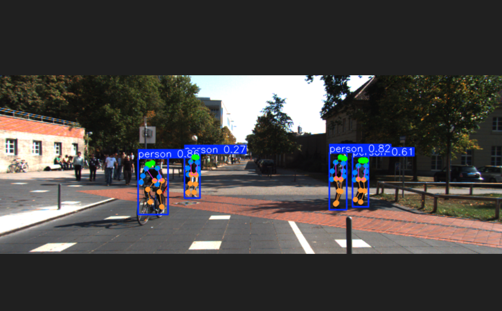
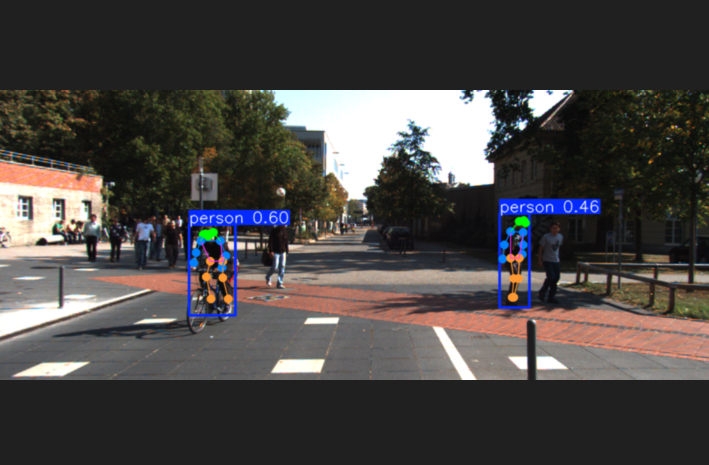
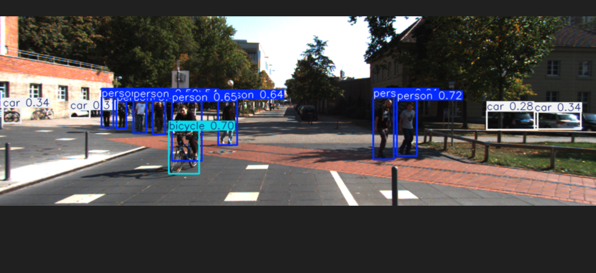

## 진행 사항
1. 각 데이터 별 시각화
2. 이미지, 라이다 정보를 사용하여 실제 좌표 체크

## KITTI GIF출력 결과(모든 오브젝트 포함)

<table>
  <tr>
    <td align="center">
       
      
kitti_0000_topview.gif

    </td>
    <td align="center">
       
      
kitti_0001_topview.gif

    </td>
    <td align="center">
       
      
kitti_0002_topview.gif

    </td>
  </tr>
  <tr>
    <td align="center">
       
      
kitti_0003_topview.gif

    </td>
    <td align="center">
       
      
kitti_0004_topview.gif

    </td>
    <td align="center">
       
      
kitti_0005_topview.gif

    </td>
  </tr>
  <tr>
    <td align="center">
       
      
kitti_0006_topview.gif

    </td>
    <td align="center">
       
      
kitti_0007_topview.gif

    </td>
    <td align="center">
       
      
kitti_0008_topview.gif

    </td>
  </tr>
  <tr>
    <td align="center">
       
      
kitti_0009_topview.gif

    </td>
    <td align="center">
       
      
kitti_0010_topview.gif

    </td>
    <td align="center">
       
      
kitti_0011_topview.gif

    </td>
  </tr>
  <tr>
    <td align="center">
       
      
kitti_0012_topview.gif

    </td>
    <td align="center">
       
      
kitti_0013_topview.gif

    </td>
    <td align="center">
       
      
kitti_0014_topview.gif

    </td>
  </tr>
  <tr>
    <td align="center">
       
      
kitti_0015_topview.gif

    </td>
    <td align="center">
       
      
kitti_0016_topview.gif

    </td>
    <td align="center">
       
      
kitti_0017_topview.gif

    </td>
  </tr>
  <tr>
    <td align="center">
       
      
kitti_0018_topview.gif

    </td>
    <td align="center">
       
      
kitti_0019_topview.gif

    </td>
    <td align="center">
       
      
kitti_0020_topview.gif

    </td>
  </tr>
</table>

## KITTI GIF출력 결과(보행자만)

<table>
  <tr>
    <td align="center">
       
      
kitti_0000_topview.gif

    </td>
    <td align="center">
       
      
kitti_0001_topview.gif

    </td>
    <td align="center">
       
      
kitti_0002_topview.gif

    </td>
  </tr>
  <tr>
    <td align="center">
       
      
kitti_0003_topview.gif

    </td>
    <td align="center">
       
      
kitti_0004_topview.gif

    </td>
    <td align="center">
       
      
kitti_0005_topview.gif

    </td>
  </tr>
  <tr>
    <td align="center">
       
      
kitti_0006_topview.gif

    </td>
    <td align="center">
       
      
kitti_0007_topview.gif

    </td>
    <td align="center">
       
      
kitti_0008_topview.gif

    </td>
  </tr>
  <tr>
    <td align="center">
       
      
kitti_0009_topview.gif

    </td>
    <td align="center">
       
      
kitti_0010_topview.gif

    </td>
    <td align="center">
       
      
kitti_0011_topview.gif

    </td>
  </tr>
  <tr>
    <td align="center">
       
      
kitti_0012_topview.gif

    </td>
    <td align="center">
       
      
kitti_0013_topview.gif

    </td>
    <td align="center">
       
      
kitti_0014_topview.gif

    </td>
  </tr>
  <tr>
    <td align="center">
       
      
kitti_0015_topview.gif

    </td>
    <td align="center">
       
      
kitti_0016_topview.gif

    </td>
    <td align="center">
       
      
kitti_0017_topview.gif

    </td>
  </tr>
  <tr>
    <td align="center">
       
      
kitti_0018_topview.gif

    </td>
    <td align="center">
       
      
kitti_0019_topview.gif

    </td>
    <td align="center">
       
      
kitti_0020_topview.gif

    </td>
  </tr>
</table>

## 이미지 데이터 시각화(left img - p2)

  
imgoutput.gif[용량때문에 이미지 사이즈 절반]

   

## 라이다 데이터 시각화

  
lidar_animation.gif 

   

## 라이다 데이터와 카메라 켈리브레이션 통해 이미지에서 라이다 정보 가져오기

## yolo-pose 와 그냥 yolo kitti 데이터셋
<table>
  <tr>
    <td align="center">
       
      
yolo v8x pose

    </td>
    <td align="center">
       
      
yolo v8x p6 pose

    </td>
    <td align="center">
       
      
yolo v11x pose

    </td>
  </tr>
  <tr>
    <td align="center">
       
      
yolo v11n 

    </td>
  </tr>
</table>

## 욜로 베이스 라인 잡아둠.(아직 미공개)

대략 구조 공개
<table>
  
</table>
